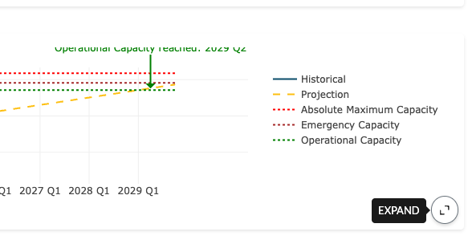
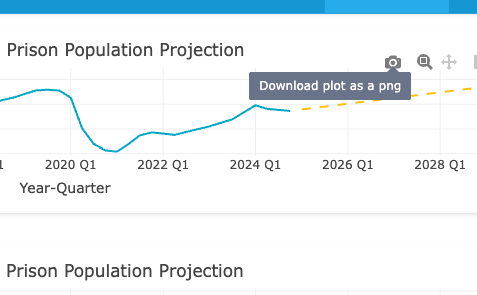

```{r}
#| label: landing-setup
#| include: false

library(dplyr)
library(scales)

uppp <- read.csv("data/uppp_dashboard_quarterly.csv", stringsAsFactors = FALSE)
summ <- read.csv("data/uppp_dashboard_summary.csv",   stringsAsFactors = FALSE) |>
  filter(scenario == "central")

cur  <- uppp |> filter(series == "Total", kind == "actual")   |> slice_tail(n = 1)
prj  <- uppp |> filter(series == "Total", kind == "forecast") |> slice_tail(n = 1)

CURRENT   <- comma(round(cur$actual))
PROJECTED <- comma(round(prj$central))
BASE_Q    <- cur$quarter_label
HORIZON_Q <- prj$quarter_label
ANN_PCT   <- summ$total_ann_growth
```

<header style="text-align:center; padding:40px 0 30px; border-bottom:1px solid #C6D0BE; margin-bottom:40px;">
  <a href="https://justice.utah.gov/" target="_blank">
    
  </a>
</header>

::: {style="background:#f5f7f9; border-left:4px solid #093692; padding:24px 28px; margin-bottom:40px; border-radius:4px;"}
**At a glance.** Utah's prison population is projected to grow from
**`r CURRENT`** in `r BASE_Q` to about **`r PROJECTED`** by `r HORIZON_Q` —
an average of **`r ANN_PCT`% per year**.

[Open the dashboard →](dashboard-2026-final.html){style="display:inline-block; margin-top:16px; background:#093692; color:#fff; padding:10px 22px; border-radius:4px; text-decoration:none; font-weight:600;"}
:::

## Dashboard features

**Welcome to the Utah Prison Population Projections Project.** This dashboard
provides snapshots and five-year projections of Utah's prison population,
benchmarked against the Utah Department of Corrections' capacity limits. It also
highlights long-term trends in the state's prison population. Hover over any
chart for interactive data exploration.

### [Overview](dashboard-2026-final.html#overview)

- **Population snapshots** — point-in-time views of the current prison population
  and the projected population five years ahead.
- **Net admissions over time** — trends in admissions minus releases. When
  admissions exceed releases, the population grows.

### [Projections](dashboard-2026-final.html#projections)

- **Five-year forecasts** — quarterly projections through `r HORIZON_Q`, with
  downloadable tables.
- **Sex breakdowns** — total population plus separate male and female series.

### [Trends](dashboard-2026-final.html#trends)

- **Average daily population by primary offense type** — which offense
  categories are driving change.
- **Average daily population by offense severity** — felony degree composition
  over time.
- **Net admissions by offense degree** — quarterly flows behind the stock.

### [Capacity](dashboard-2026-final.html#capacity)

- **Capacity benchmarking** — current and projected populations against UDC's
  three capacity thresholds: operational (96.5%), emergency (98%), and absolute
  maximum (100%).
- **Note that capacity numbers are updated as of 2026 Q2 and fluctuate through time.**

### [Methodology](dashboard-2026-final.html#methodology)

- Full documentation of data sources, model specification, and projection
  methods.

---

## Tips for using the dashboard

::: {.tutorial-grid style="display:grid; grid-template-columns:repeat(auto-fit, minmax(300px, 1fr)); gap:20px; margin:30px 0;"}

::: {.tutorial-step style="background:#fff; border-radius:8px; padding:20px; box-shadow:0 2px 4px rgba(0,0,0,.1);"}
{fig-alt="The expand control in the corner of a chart" style="width:100%; border-radius:4px; margin-bottom:15px;"}

**Expand any chart**

Hover over a plot or table and click the arrows in the corner to view it full screen.
:::

::: {.tutorial-step style="background:#fff; border-radius:8px; padding:20px; box-shadow:0 2px 4px rgba(0,0,0,.1);"}
{fig-alt="The camera icon in a chart's toolbar" style="width:100%; border-radius:4px; margin-bottom:15px;"}

**Download a chart**

Hover over a plot and click the camera icon in the toolbar to save it as an image.
:::

:::

---

## Acknowledgements

The Utah Prison Projection Project (UPPP) is a collaborative effort between the
Utah Department of Corrections (UDC) and the Utah Department of Criminal Justice. We are grateful to UDC for their partnership, expertise, and for
providing the data that underpins this project.

## Contact

Questions or comments: [ccjj.research@utah.gov](mailto:ccjj.research@utah.gov)

::: {style="color:#565656; font-size:.9rem; margin-top:30px; padding-top:20px; border-top:1px solid #C6D0BE;"}
Data current as of `r BASE_Q`. Projections extend through `r HORIZON_Q`.
:::